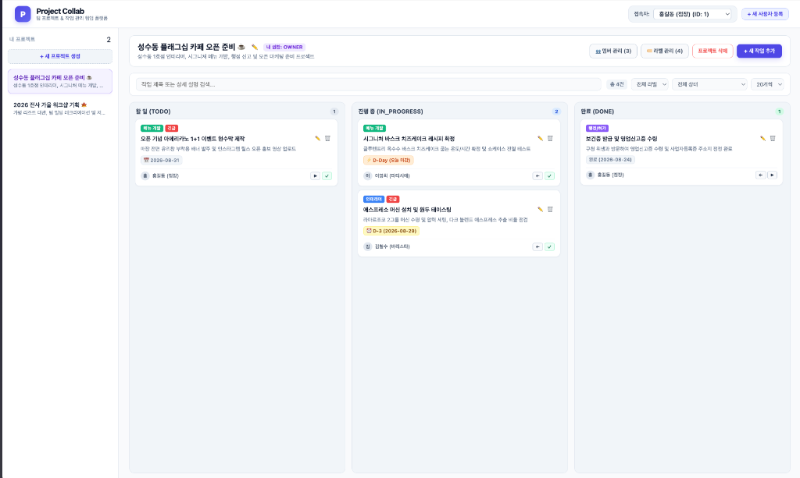
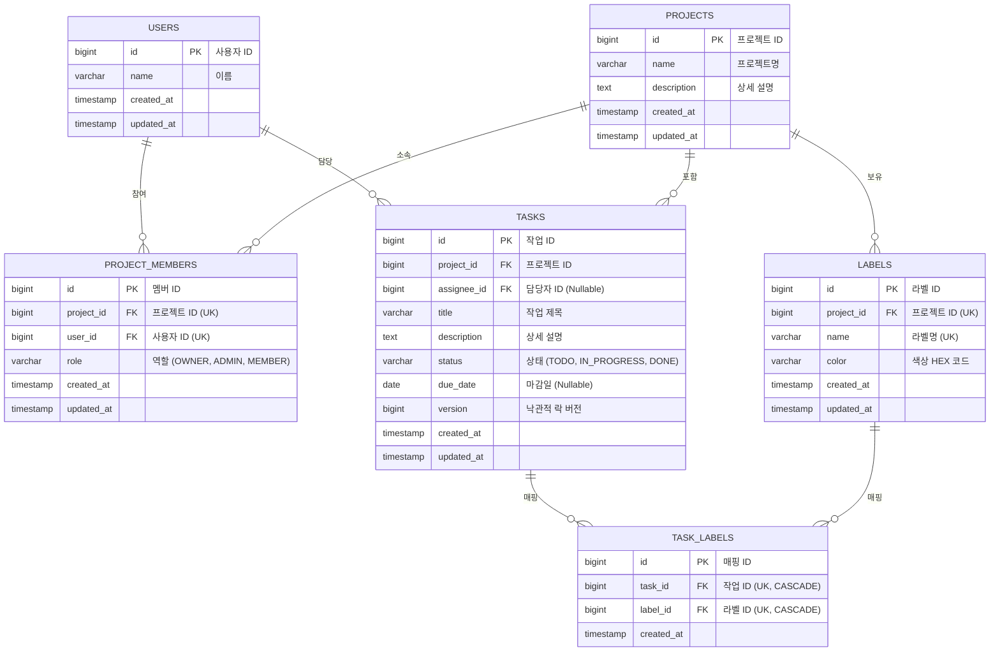
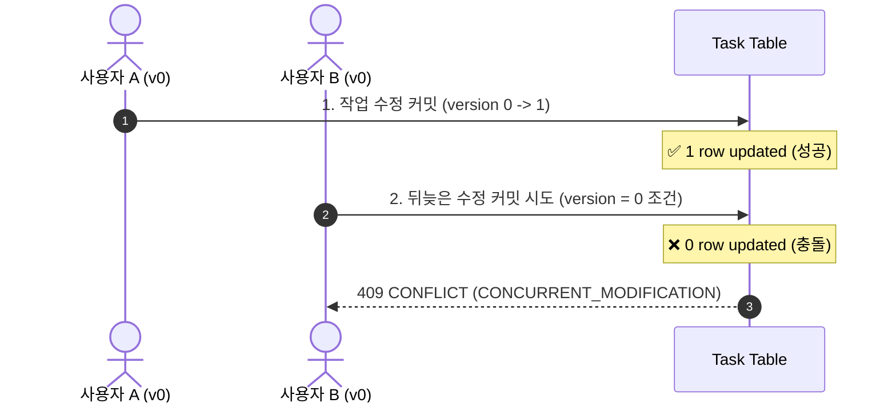
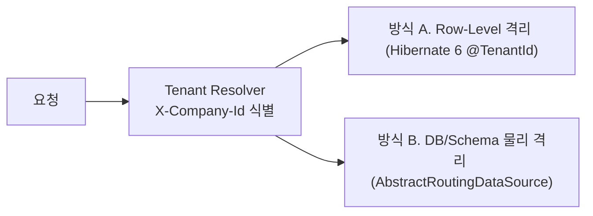

# Project Collab

Spring Boot 3와 React 18 기반의 팀 작업 관리 및 칸반 협업 플랫폼입니다.



---

## 1. 핵심 기능

- **3열 칸반 보드**: TODO / IN_PROGRESS / DONE 단계 관리 및 퀵 상태 전환
- **복합 동적 필터링**: 라벨 + 상태 + 키워드 검색(Debounce 300ms) 동적 조합
- **D-Day 마감일 알림**: 당일 마감, 기한 임박(D-3), 기한 초과 뱃지 자동 계산
- **프로젝트 라벨**: 8개 프리셋 컬러 라벨 생성/삭제 및 연쇄 삭제(Cascade) 처리
- **역할 기반 접근 제어 (RBAC)**: OWNER, ADMIN, MEMBER 3단계 권한 제어
- **동시성 제어**: JPA 낙관적 락(@Version)을 통한 동시 수정 충돌(409 Conflict) 방어

---

## 2. 권한 매트릭스 (RBAC)

| 기능 | OWNER | ADMIN | MEMBER | 비멤버 |
| :--- | :---: | :---: | :---: | :---: |
| 프로젝트 삭제 | O (단독) | X | X | X |
| 프로젝트 정보 수정 | O | O | X | X |
| 멤버 초대 / 제외 / 역할 변경 | O | O (OWNER 제외) | X | X |
| 라벨 생성 / 삭제 | O | O | X | X |
| 작업 생성 / 조회 | O | O | O | X |
| 작업 수정 / 삭제 | O | O | 본인 담당 작업만 | X |
| 작업 상태 변경 (TODO/진행/완료) | O | O | O (협업 지원) | X |

---

## 3. 데이터베이스 설계 (ERD)



---

## 4. 주요 설계 결정 (Trade-off 및 도메인 판단 근거)

### 1) 기술적 Trade-off 분석
- **동적 쿼리: JPA Specification 채택 (vs QueryDSL)**:
  - 별도 APT/QClass 빌드 설정 없이 표준 JPA 라이브러리만으로 가볍게 구현.
  - `Predicate`를 함수형으로 조립하는 `TaskSpecification.searchBy()`로 서비스 레이어 단순화.
- **사용자 식별: Custom HandlerMethodArgumentResolver**:
  - `GET`, `DELETE` 등 Request Body가 없는 요청을 포함해 모든 API에서 `X-User-Id` 헤더로 일관되게 식별. 요청 위조 방지 및 Spring Security 전환 용이.
- **도메인 모델링: 엔티티 내부 검증 캡슐화 (단일 속성 VO 지양)**:
  - 단일 문자열 래핑 VO로 인한 클래스 수 폭증 및 getter 체이닝 보일러플레이트 방지. 엔티티 내부 `validateTitle()` 등으로 도메인 무결성 보장.
- **실용적 계층형 아키텍처**:
  - 단일 RDB 환경에서 불필요한 Repository DIP 분리를 배제하고, Spring Data JPA의 기능을 직접 활용하여 비즈니스 로직에 집중.

### 2) 비즈니스 / 도메인 규칙 판단 근거
- **작업 상태(Status) 변경 권한 개방 (협업 기동성 확보)**:
  - *고민*: 작업 수정은 본인 담당 작업만 가능한데, 칸반 보드의 상태 이동(TODO ➔ DONE)도 담당자만 해야 하는가?
  - *결정*: 칸반 협업의 기동성을 위해 상태 전환은 모든 프로젝트 멤버에게 개방하고, 제목/설명/마감일 등 주요 정보 수정만 담당자/관리자로 제한.
- **라벨 삭제 시 작업(Task) 데이터 보존 정책**:
  - *고민*: 라벨 삭제 시 라벨이 부착된 작업까지 함께 삭제할 것인가?
  - *결정*: 작업 데이터 유실을 방지하기 위해 Task는 보존하고, 매핑 테이블(`TaskLabel`)의 관계만 연쇄 해제(`ON DELETE CASCADE`)하여 데이터 무결성 유지.
- **고아(Orphan) 프로젝트 방지를 위한 마지막 OWNER 보호 규칙**:
  - *고민*: 프로젝트 관리자가 본인 역할을 MEMBER로 강등하거나 탈퇴할 때의 예외 처리.
  - *결정*: 관리자가 0명이 되는 고아 프로젝트 발생을 원천 차단하기 위해 "마지막 남은 OWNER는 역할을 변경하거나 탈퇴할 수 없다"는 도메인 방어 규칙을 선제 적용.

---

## 5. 동시성 제어 (낙관적 락)

다중 사용자가 동일 작업을 동시 수정할 때 발생하는 **갱신 분실(Lost Update)**을 방지하기 위해 JPA `@Version` 기반 낙관적 락을 적용했습니다.



- 충돌 발생 시 `ObjectOptimisticLockingFailureException` ➔ `409 Conflict` 반환.
- `TaskConcurrencyTest`를 통해 동시 수정 시 1건 성공 / 1건 409 충돌 검증 완료.

---

## 6. 멀티테넌시(Multi-Tenancy) 확장 전략



- **방식 A (Row-Level, 권장)**: `@TenantId`를 통한 자동 테넌트 조건 바인딩.
- **방식 B (물리 격리)**: 고객사별 DB/Schema 분리 및 커넥션 풀 동적 라우팅.

---

## 7. 주요 REST API 명세

| 도메인 | HTTP Method & URI | 설명 | 권한 조건 |
| :--- | :--- | :--- | :--- |
| **User** | `POST /api/v1/users` | 사용자 생성 | 전체 |
| | `GET /api/v1/users` | 사용자 목록 조회 | 전체 |
| **Project** | `POST /api/v1/projects` | 프로젝트 생성 | 전체 (생성자: OWNER) |
| | `GET /api/v1/projects` | 내 프로젝트 목록 조회 | 참여 프로젝트만 필터링 |
| | `PUT /api/v1/projects/{projectId}` | 프로젝트 정보 수정 | OWNER, ADMIN |
| | `DELETE /api/v1/projects/{projectId}` | 프로젝트 삭제 | OWNER 단독 |
| **Member** | `POST /api/v1/projects/{projectId}/members` | 멤버 초대 | OWNER, ADMIN |
| | `PUT /api/v1/projects/{projectId}/members/{userId}` | 역할 변경 | OWNER, ADMIN |
| | `DELETE /api/v1/projects/{projectId}/members/{userId}` | 멤버 제외(강퇴) | OWNER, ADMIN |
| **Label** | `POST /api/v1/projects/{projectId}/labels` | 라벨 생성 | OWNER, ADMIN |
| | `GET /api/v1/projects/{projectId}/labels` | 라벨 목록 조회 | 프로젝트 멤버 |
| | `DELETE /api/v1/projects/{projectId}/labels/{labelId}` | 라벨 삭제 (CASCADE) | OWNER, ADMIN |
| **Task** | `POST /api/v1/projects/{projectId}/tasks` | 작업 생성 | 프로젝트 멤버 |
| | `GET /api/v1/projects/{projectId}/tasks` | 작업 목록 조회 (상태/라벨/키워드 동적 검색) | 프로젝트 멤버 |
| | `PUT /api/v1/projects/{projectId}/tasks/{taskId}` | 작업 수정 (낙관적 락) | 담당자 본인 또는 OWNER, ADMIN |
| | `DELETE /api/v1/projects/{projectId}/tasks/{taskId}` | 작업 삭제 | 담당자 본인 또는 OWNER, ADMIN |

---

## 8. 시연용 샘플 계정 가이드 (Demo Accounts)

애플리케이션 실행 시 `DataInitializer`를 통해 시연용 데이터가 자동 적재됩니다.  
우측 상단 접속자 선택 드롭다운에서 사용자를 전환하며 권한별 동작을 테스트할 수 있습니다.

- **홍길동 (점장, ID: 1)**: `OWNER` (프로젝트 1 소유자 - 프로젝트 삭제, 라벨 생성/삭제, 전체 작업 관리 가능)
- **김철수 (바리스타, ID: 2)**: `ADMIN` (프로젝트 1 관리자 / 프로젝트 2 소유자 - 멤버 초대, 라벨 관리 가능)
- **이영희 (파티시에, ID: 3)**: `MEMBER` (프로젝트 1 일반 멤버 - 본인 작업 수정, 칸반 상태 전환 가능)

---

## 9. 기술 스택

- **Backend**: Java 17, Spring Boot 3.3.13, Spring Data JPA, H2 Database
- **Frontend**: React 18, TailwindCSS (모듈형 컴포넌트 & 단일 실행 SPA)
- **Testing**: JUnit 5, AssertJ, Mockito, Spring Boot Test (115개 테스트 통과)
- **API Docs**: Springdoc OpenAPI 3.0 (Swagger)

---

## 10. 실행 방법

```bash
# 빌드 및 전체 테스트 검증 (115개 테스트)
./gradlew clean test build

# 로컬 실행
./gradlew bootRun
```

- **웹 접속**: `http://localhost:8080`
- **Swagger API 문서**: `http://localhost:8080/swagger-ui/index.html`
- **H2 Database 콘솔**: `http://localhost:8080/h2-console` (`jdbc:h2:mem:projectcollab`)
